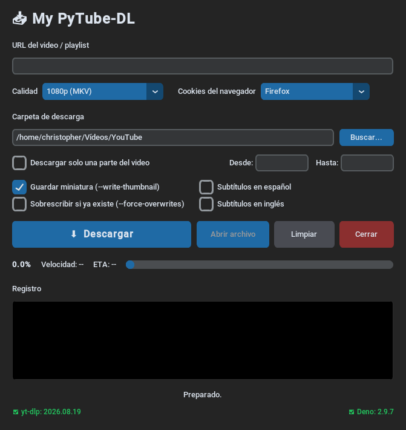

# My PyTube-DL

Descargador de vídeos de YouTube con interfaz gráfica, en Linux y Windows.
Envuelve [yt-dlp](https://github.com/yt-dlp/yt-dlp) y muestra el progreso, la
velocidad y el tiempo estimado en la propia ventana.

  



## Características

- Descarga de un vídeo o de una playlist completa.
- Elección de calidad (720p, 1080p, 4K, la mejor disponible) o solo el audio
  en MP3.
- **Descargar solo una parte**: delimitas el inicio y el final con *Desde* y
  *Hasta*.
- Subtítulos en español o inglés (`--write-subs`), en `.srt` o el mejor formato
  disponible.
- Guardar la miniatura (`--write-thumbnail`).
- Sobrescribir el archivo si ya existe (`--force-overwrites`).
- Cookies del navegador (Firefox, Google Chrome, Chromium, Edge, Opera, Vivaldi,
  Brave y Zen Browser) para vídeos con restricción de edad o que exigen sesión
  iniciada. El desplegable solo muestra los navegadores que tienen una base de
  cookies real en el equipo, así que nunca ofrece uno que vaya a fallar.
- Progreso con porcentaje, velocidad y ETA, y registro de la descarga en una
  consola verde sobre negro.
- Botón para **actualizar yt-dlp** sin tocar la terminal.
- Al abrir, comprueba si **yt-dlp** y **Deno** están al día. El color del pie
  dice el estado: **verde** al día, **rojo** desactualizado o ausente, y
  **amarillo** si no se pudo verificar (sin red). Si algo está desactualizado
  aparece su botón para actualizarlo, con un popup de confirmación.
- Abrir el último archivo descargado con un clic.
- Menú contextual en el campo de URL: cortar, copiar, pegar y seleccionar todo,
  con el tema oscuro de la aplicación.
- Selector de carpeta propio, también en tema oscuro, en lugar del diálogo del
  sistema.

## Requisitos

| Dependencia | Para qué | Obligatoria |
|---|---|---|
| Python 3.10 o superior | la app | sí |
| [yt-dlp](https://github.com/yt-dlp/yt-dlp) | descarga | sí |
| [ffmpeg](https://ffmpeg.org/) | fusionar vídeo + audio | muy recomendable |
| [Deno](https://deno.com/) | runtime JS que yt-dlp necesita para YouTube | muy recomendable |
| Python `tkinter` | viene con Python en Linux vía paquete aparte | sí |

> En YouTube, `yt-dlp` necesita un runtime JavaScript. Sin Deno, muchas
> descargas fallarán aunque el vídeo sea público. La app comprueba si está
> disponible y lo avisa.

## Instalación

### Linux

```bash
./setup_linux.sh
```

Instala los paquetes del sistema (`python`, `tk`, `ffmpeg`), crea el entorno
`.venv`, instala las dependencias de `requirements.txt`, actualiza `yt-dlp`,
lo enlaza en `~/.local/bin` e instala Deno si falta.

### Windows

```bat
setup_windows.bat
```

Abre PowerShell y ejecuta:

```powershell
powershell -ExecutionPolicy Bypass -File setup_windows.ps1
```

Instala `yt-dlp` con `pip --user`, crea el entorno `.venv` e instala las
dependencias de `requirements.txt`.

## Uso

```bash
./launcher.sh          # Linux
```

```bat
launcher_win.bat       # Windows
```

Los dos lanzadores eligen el intérprete por este orden: el `.exe` ya compilado
(solo en Windows), el entorno `.venv` del proyecto y, si no existe, el Python
del sistema. Además comprueban que falte `customtkinter`, avisan si `yt-dlp` o
`ffmpeg` no están en el `PATH` y, en Linux, buscan un servidor X11.

También puedes arrancarla directamente:

```bash
.venv/bin/python My-PyTube-DL.py
```

## Compilar a .exe (Windows)

```bat
build_windows.bat
```

Genera `dist\My-PyTube-DL.exe` en un entorno aparte (`.venv-build`)
para no tocar el de desarrollo. Usa los iconos `icono-app.ico` y
`icono-app.png` del propio
proyecto y `--clean`, así que no reutiliza nada de compilaciones anteriores.

En la máquina donde se use el `.exe` deben estar `yt-dlp` y `ffmpeg` en el
`PATH`:

```bat
pip install yt-dlp
winget install DenoLand.Deno
```

## Problemas frecuentes

### `TclError: no display name and no $DISPLAY environment variable`

La sesión es Wayland y la terminal no trae `DISPLAY`. Tk solo habla X11, así que
necesita apuntar al XWayland. `launcher.sh` lo detecta solo, pero si lo ejecutas
a mano:

```bash
DISPLAY=:1 .venv/bin/python My-PyTube-DL.py
```

En niri, comprueba que XWayland esté activo con `xwayland enable`. Sin ningún
servidor X la app no puede abrir ventana; solo funcionaría con un X virtual
(`Xvfb`), sin mostrar nada.

### `yt-dlp no está instalado o no está en el PATH`

```bash
pip install -U yt-dlp        # dentro del venv
.venv/bin/python -m pip install -U yt-dlp
```

Comprueba que `.venv/bin` esté en el `PATH` o usa siempre `launcher.sh`, que
añade esa ruta.

### La descarga falla en vídeos con restricción de edad

Si el error es `Sorry, this content is age-restricted`, casi nunca es la
restricción en sí: es que YouTube no resolvió el reto de JavaScript y responde
con ese mensaje genérico. La app ya pasa `--remote-components ejs:github` para
que yt-dlp descargue el solver, así que comprueba en este orden:

1. Que **Deno** esté instalado y localizable (`deno --version`). La app añade
   `~/.deno/bin` al `PATH` del proceso, pero si no es ese el problema,
   instálalo: `curl -fsSL https://deno.land/install.sh | sh`.
2. Que las **cookies del navegador** estén actualizadas: elige tu navegador y
   déjalo abierto con la sesión iniciada en una cuenta verificada de edad.
3. Que **yt-dlp** esté al día (botón *Actualizar* en la app).

Los avisos `Signature solving failed` / `n challenge solving failed` /
`GVS PO Token` que aparecen en el registro son ruido: el solver ya ha resuelto
el reto y la descarga va a funcionar igualmente.

### Faltan vídeos en una playlist

YouTube devuelve playlists incompletas. Desmarca *Cookies del navegador* o
actualiza yt-dlp desde el botón de la app.

## Estructura del proyecto

| Fichero | Función |
|---|---|
| `My-PyTube-DL.py` | toda la aplicación |
| `launcher.sh` / `launcher_win.bat` | lanzadores para Linux y Windows |
| `setup_linux.sh` | instalación en Linux |
| `setup_windows.bat` / `setup_windows.ps1` | instalación en Windows |
| `build_windows.bat` | empaquetado a `.exe` con PyInstaller |
| `requirements.txt` | dependencias de Python |
| `icono-app.ico` / `icono-app.png` | iconos del ejecutable y de la ventana |
| `Screenshot-My-PyTube-DL.png` | captura mostrada al principio de este README |

La configuración se guarda en `~/.config/yt-dlp-gui/config.json`, fuera del
repositorio.

## Licencia

MIT.
